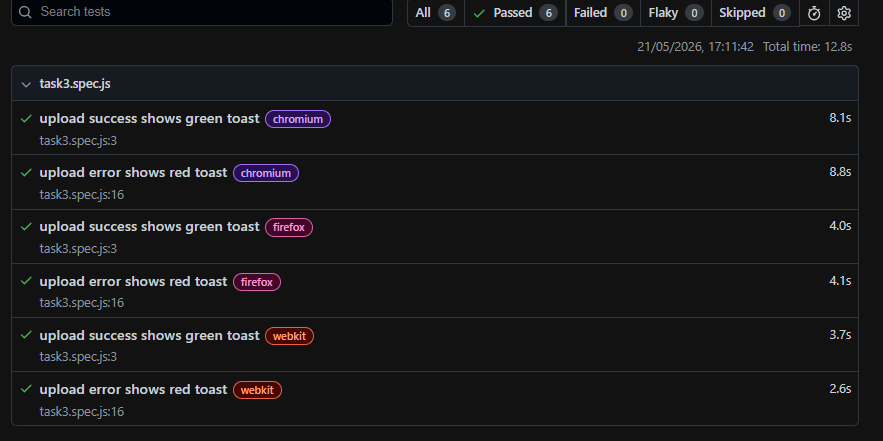
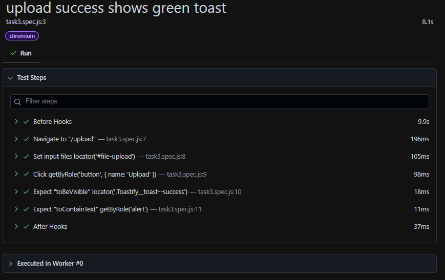

# Playwright Test Runner

This project contains Playwright tests for the React Bookstore application.

## Test Files

### Task 1

- `task1.spec.js` - Login flow test

### Task 2

- `setup.spec.js` - Login setup - authenticates and saves session state
- `task2.spec.js` - Protected pages test (Dashboard, Feed, Profile, Settings)
- `teardown.spec.js` - Cleanup - removes saved session state

### Task 3

- `task3.spec.js` - Upload functionality test
- `Helllo.pdf` - Dummy PDF file for upload testing

---

## Task 1 - Login Flow Test

Tests the complete login flow:

1. Navigate to `/login`
2. Enter email: `test@test.com`
3. Enter password: `password`
4. Click Login button
5. Verify "Welcome back!" message is visible
6. Verify "Click Me" button is visible
7. Click "Click Me" button
8. Click Logout button

**Task 1 Images:**


---

## Task 2 - Protected Pages Test

### Setup (setup.spec.js)

1. Navigate to `/login`
2. Fill credentials
3. Click Login
4. Save storage state to `storageState.json`
5. Verify Dashboard is visible

### Test (task2.spec.js)

Tests all protected pages after authentication:

1. Navigate to `/dashboard` - Verify Dashboard heading
2. Navigate to `/feed` - Verify Activity Feed heading
3. Navigate to `/profile` - Verify User Profile heading
4. Navigate to `/settings` - Verify Settings heading

### Teardown (teardown.spec.js)

1. Remove `storageState.json` file
2. Cleanup saved login session

**Task 2 Images:**


---

## Task 3 - Upload Functionality Test

Tests PDF upload with network interception (no backend required).

### Test 1 - Upload Success (task3.spec.js)

1. Intercept `/api/upload` route with `page.route()`
2. Return mock 200 response
3. Navigate to `/upload`
4. Attach `Helllo.pdf` to file input
5. Click Upload button
6. Assert green success toast is visible

### Test 2 - Upload Error (task3.spec.js)

1. Intercept `/api/upload` route with `page.route()`
2. Return mock 500 response
3. Navigate to `/upload`
4. Attach `Helllo.pdf` to file input
5. Click Upload button
6. Assert red error toast is visible

**Note:** Network interception via `page.route()` means no real backend is needed - Playwright mocks the API responses.

**Task 3 Images:**





---

## Playwright Configuration

- **baseURL**: `http://localhost:5173`
- **Browser**: Chromium, Firefox, WebKit
- **Test Directory**: `./tests`
- **Parallel Execution**: Enabled
- **Reporter**: HTML

## Running Tests

```bash
npx playwright test
```
