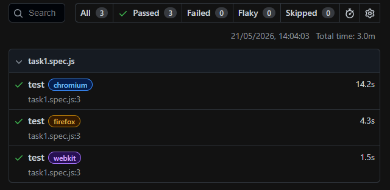
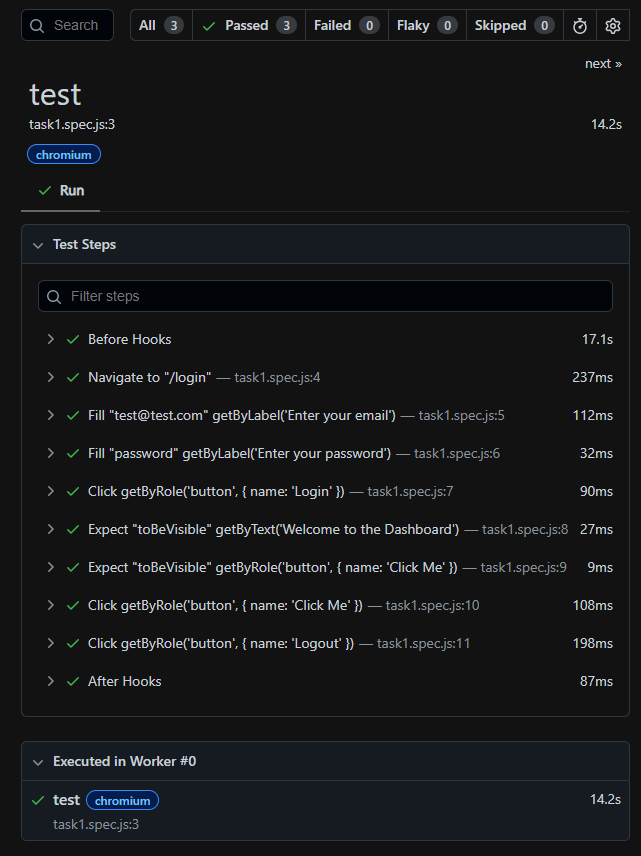
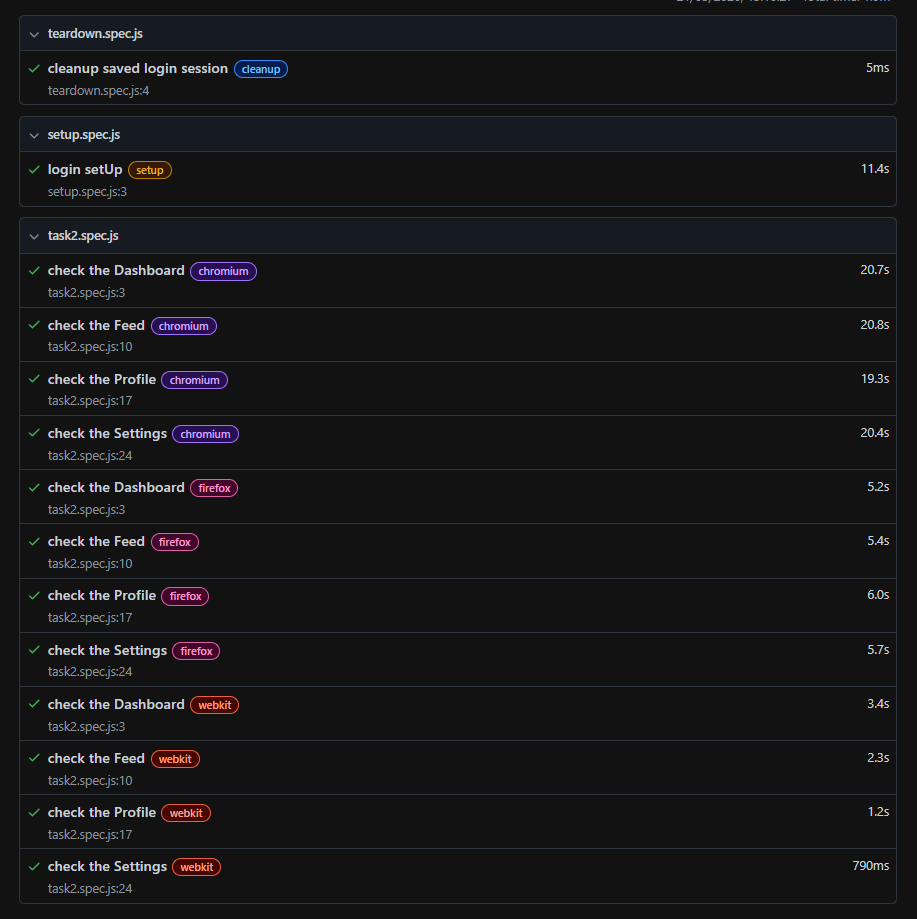
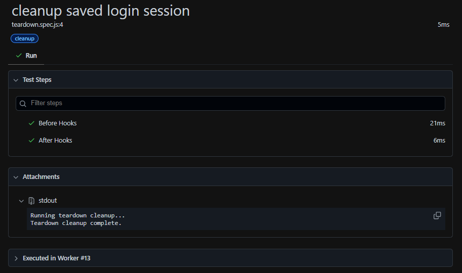
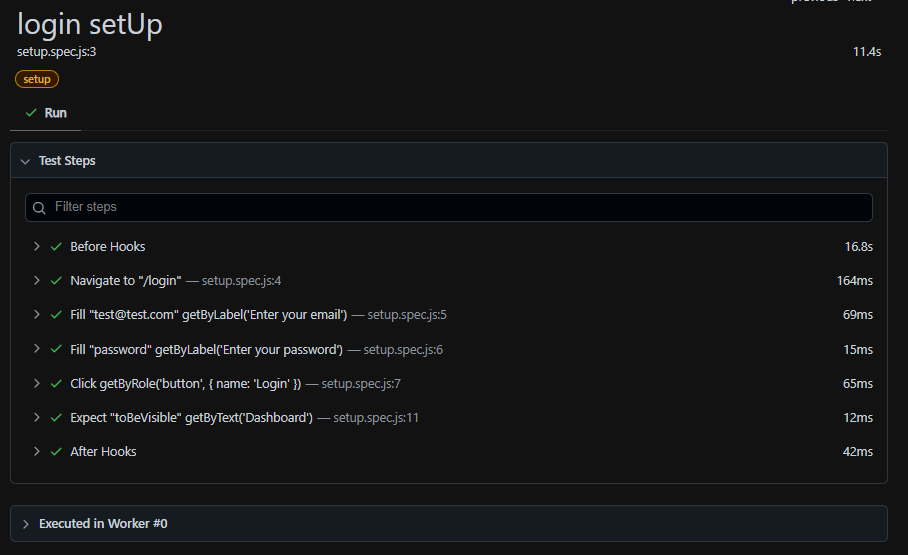
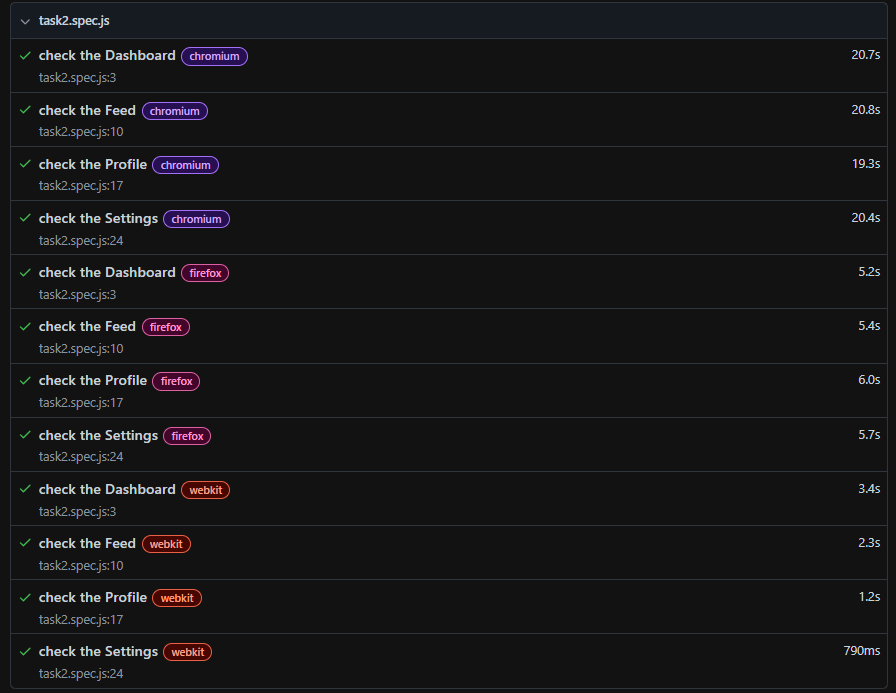

# Playwright Test Runner

This project contains Playwright tests for the React Bookstore application.

## Test Files

| Test File          | Description                                         |
| ------------------ | --------------------------------------------------- |
| `setup.spec.js`    | Login setup - authenticates and saves session state |
| `task1.spec.js`    | Task 1 - Login flow test                            |
| `task2.spec.js`    | Task 2 - Protected pages test                       |
| `teardown.spec.js` | Cleanup - removes saved session state               |

## Task 1 - The Sandbox

Tests the complete login flow:

1. Navigate to `/login`
2. Enter email: `test@test.com`
3. Enter password: `password`
4. Click Login button
5. Verify "Welcome back!" message is visible
6. Verify "Click Me" button is visible
7. Click "Click Me" button
8. Click Logout button

**Task 1 Images:**





## Task 2 - The Pro Setup

Tests all protected pages after authentication:

1. Navigate to `/dashboard` - Verify Dashboard heading
2. Navigate to `/feed` - Verify Activity Feed heading
3. Navigate to `/profile` - Verify User Profile heading
4. Navigate to `/settings` - Verify Settings heading

**Task 2 Images:**









## Setup (setup.spec.js)

1. Navigate to `/login`
2. Fill credentials
3. Click Login
4. Save storage state to `storageState.json`
5. Verify Dashboard is visible

## Teardown (teardown.spec.js)

1. Remove `storageState.json` file
2. Cleanup saved login session

## Playwright Configuration

- **baseURL**: `http://localhost:5173`
- **Browser**: Chromium
- **Test Directory**: `./tests`
- **Parallel Execution**: Enabled
- **Reporter**: HTML

## Running Tests

```bash
npx playwright test
```
